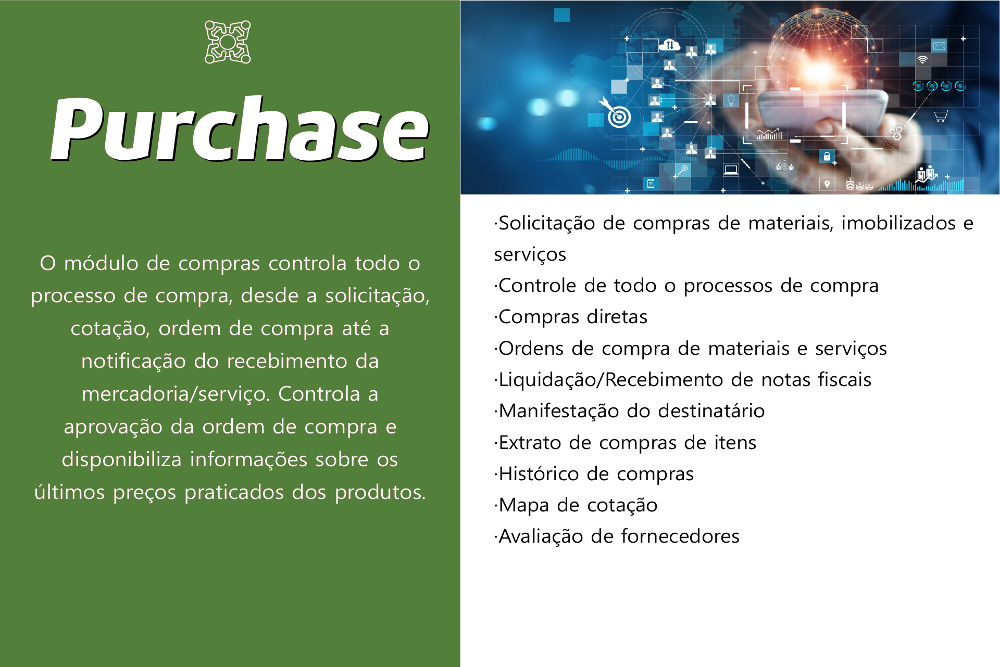

# Compras (Purchase)

<figure><figcaption>
O Manual do Módulo de Compras tem como objetivo orientar usuários no uso correto e eficiente das funcionalidades disponíveis para a gestão de processos de aquisição dentro do sistema ERP.
</figcaption></figure>

***



### Objetivo

Estabelecer um procedimento padrão para assegurar que os processos de compras de materiais (matérias primas e/ou insumos), permanentes ou serviços sejam realizados com as especificações e as garantias necessárias, bem como assegurar que os fornecedores que afetam a qualidade dos produtos finais tenham capacidade técnica comprovada de atendimento.



### &#x20;Área de Aplicação

Este procedimento se aplica para os setores de Compras, Tecnologia da Informação, Serviços Gerais, Serviços de Apoio Operacional, Manutenção Predial, Gestão da Qualidade e Obras.



### Responsabilidades

É responsabilidade do setor de compras elaborar as cotações de preços, realizar as compras e acompanhá-las até o momento da entrega, fazendo os contatos com fornecedores.&#x20;

**Nota:** As compras destinadas a materiais, peças e serviços de manutenção de veículos e materiais, peças e serviços de obras, são de responsabilidade do setor referente à gestão do contrato em questão. O setor de compras ficará responsável pela auditoria das compras realizadas por esses setores.



### Definição e Conceitos

1. **Solicitação de Compra (SC) –** Processo inicial de uma compra, através do qual será solicitada a compra de um material ou serviço informando quantidade, descrição, prazo de entrega, local de entrega e todas as informações que serão necessárias para a compra.&#x20;
2. **Mapa de Cotação (MC) –** Documento que demonstra as cotações dos produtos solicitados, subdividindo-as por fornecedor. O comprador deverá comparar as cotações e escolher o melhor preço, prazo de entrega e condições de pagamento.&#x20;
3. **Pedido de Compra Direta (PC) –** Documento que demonstra o fornecedor único e o preço cotado, quando não há necessidade de cotação com mais de um fornecedor ou se trata de um fornecedor exclusivo.
4. **Ordem de Compra (OC) –** Documento utilizado para formalizar a compra de produtos ou serviços.&#x20;
5. **Solicitante –** Pessoa que solicita uma cotação e/ou compra.&#x20;
6. **Comprador –** Pessoa que elabora as cotações de preços, realiza as compras e acompanha até o momento da entrega, fazendo os contatos com fornecedores.&#x20;
7. **Aprovador –** Pessoa que confere se os itens solicitados estão de acordo com a necessidade do setor solicitante.&#x20;
8. **Fornecedores Homologados –** fornecedores em que serão negociadas as especificações técnicas, preços, prazos de entrega e condições de pagamento em cada compra.&#x20;
9. **Avaliação de Fornecimento –** Registro de conformidades e/ou não conformidades no ato do recebimento de produtos e/ou serviços.



### Procedimento

O procedimento de compra pode se resumir nos seguintes pontos: \
•      Solicitação de compra;\
•      Pré seleção dos fornecedores;\
•      Seleção dos fornecedores através do mapa de cotação;\
•      Ordem de Compra;\
•      Recebimento do material/serviço com a Nota Fiscal e liquidação da Ordem de Compra;\
•      Avaliação dos fornecedores;\
•      Auditoria de compras.&#x20;

1.  **Solicitação de Compra** \
    Processo através do qual pode ser solicitada a compra de materiais ou serviços. Tal solicitação deverá ser realizada através do módulo **Compras(Purchase)**.

    A solicitação deve ser contemplar os seguintes dados: quantidade, descrição do produto e/ou serviço, centro de custo, verba orçamentária (se houver), prazo de entrega e local de entrega.

    Posteriormente, o comprador deverá avaliar a razoabilidade da solicitação de compra, considerando o histórico de compras e consumo médio do produto, e caso haja questionamento em relação à necessidade da compra o aprovador deverá ser consultado e aprovar a solicitação de compras.&#x20;
2. **Pré Seleção dos fornecedores** \
   O comprador após ter recebido uma solicitação de compra deverá procurar no mercado os possíveis fornecedores dos produtos e/ou serviços solicitados. Tal pesquisa poderá ser feita pela internet, por indicação/sugestão de outros fornecedores/clientes, ou por outras formas tais como revista, propagandas etc. Os fornecedores selecionados com capacidade de atendimento são qualificados conforme a descrição do item 5.3.1 (Requisitos de Qualificação para Fornecimento de Materiais ou Serviços), posteriormente os mesmos são cadastrados no sistema e considera-se que estão aprovados para realizar fornecimento.&#x20;
3.  **Seleção de fornecedores** \
    Quando o comprador selecionar o mínimo de três fornecedores para suprir a solicitação, o mesmo deverá apresentar os fornecedores selecionados ao responsável pela solicitação que deverá avaliar se os mesmos atendem aos requisitos técnicos exigidos para o produto ou serviço. \
    **Nota:** Caso estejam sendo cotados itens recorrentes ou quando o material ou serviço solicitado se tratar de fornecimento exclusivo, deverá gerar pedido de compra direta sem processo de compra, e o mesmo será preenchido apenas com o fornecedor que possa atender as particularidades exigidas. \
    \
    1\.   **Requisitos de Qualificação para Fornecimento de Materiais ou Serviços**&#x20;

    Considera-se fornecedor qualificado aquele que atenda a um ou mais dos itens descritos abaixo:&#x20;

    a)      Certificação de qualidade;

    b)      Fornecedor exclusivo no mercado;

    c)      Atestado de capacidade Técnica;

    d)      Parceiro de Negócios;

    e)      Fornecedor Indicado pelo Cliente;

    f)       Verificação de material ou serviço fornecido;

    g)      Melhor Preço. \

4.  **Ordem de Compra** \
    Após o aprovador selecionar o melhor fornecedor para a compra em questão, o comprador, homologa a Ordem de Compra de Material / Serviço com os dados do fornecedor, quantidade, condição de pagamento, descrição, preços, data e local de entrega.&#x20;

    A Ordem de Compra de Material / Serviço deverá ser conferida e aprovada pelo aprovador de acordo com o item 5.4.1 deste manual, a partir deste momento o comprador poderá enviar a Ordem de Compra de Material / Serviço para o fornecedor. Por fim, o comprador encaminhará cópia da Ordem de Compra de Material / Serviço para os responsáveis pelo recebimento dos produtos e/ou serviços adquiridos. \
    \
    1\.   **Limites de Competência** \
    Autorização de despesas relativas à aquisição de materiais e/ou serviços podem ser aprovadas pelo gerente de compras em até R$ 5.000,00 (cinco mil reais), os demais gerentes do escritório central ou colaborador delegado pela diretoria podem aprovar até R$ 1.000,00 (mil reais), despesas acima desse valor devem ser autorizadas pela diretoria imediata do solicitante. \
    Os limites de competência para os gestores de contratos serão definidos pela diretoria na abertura do centro de custo, caso as despesas ultrapassem a alçada definida, devem ser autorizadas pela diretoria responsável pela gestão do contrato.&#x20;
5. **Recebimento**\
   Os responsáveis pelo recebimento dos produtos e/ou serviços adquiridos, deverão verificar se os mesmos estão de acordo com o que foi descrito na Ordem de Compra de Material / Serviço, que por sua vez, será encaminhada ao setor financeiro para conferência e posterior avaliação do fornecedor via sistema.
6.  **Avaliação dos fornecedores** \
    Consideram-se fornecedores críticos aqueles que afetam diretamente a qualidade dos serviços da empresa, portanto serão avaliados aqueles que fornecem produtos/equipamentos de obras civis, elétricas e mecânicas e aqueles que sejam julgados necessários no ato da contratação pela diretoria e/ou pelos responsáveis das solicitações de compras. As avaliações dos fornecedores serão realizadas através de análise da avaliação de fornecimento. \
    \
    A avaliação de fornecedores considera os seguintes critérios: \
    a)      Qualidade dos produtos e/ou serviços;\
    b)      Preço;\
    c)      Pontualidade e respeito aos prazos;\
    d)      Atendimento. \
    \
    Os critérios acima podem ser pontuados da seguinte forma:\
    a)      01 ponto (Ruim)\
    b)      02 ponto (Regular)\
    c)      03 ponto (Bom)\
    \
    O fornecedor deve apontar resultado igual ou superior a 8 pontos, em caso de divergências serão tomadas providencias juntamente com a Diretoria, que podem ser:\
    •      Contato telefônico ou e-mail solicitando melhorias;

    •      Suspensão do fornecedor até a correção das divergências;

    •      Exclusão do fornecedor.\
    \
    **Nota:** As providencias descritas acima não são aplicáveis aos fornecedores exclusivos.\

7.  **Auditoria de Compras**&#x20;

    Periodicamente será realizada pelo gerente de compras a auditoria das compras realizadas pelos setores responsáveis por gestão de contrato.

    O responsável pela auditoria auditará uma amostragem de dez mapas de cotação do contrato.

    Caso sejam verificadas anomalias, as tratativas ficarão a cargo da diretoria.

<figure><figcaption></figcaption></figure>


